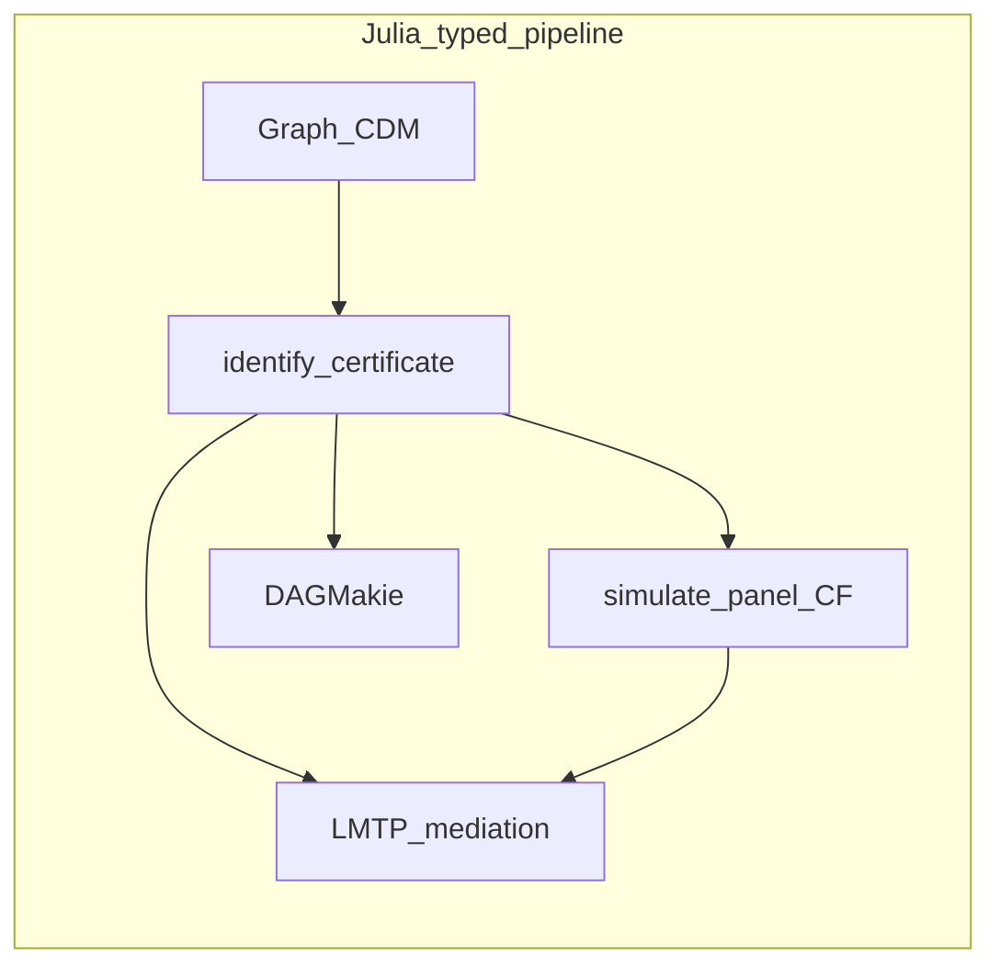

# How CausalDynamics compares

CausalDynamics.jl owns **identify → intervene → shared-`U` counterfactual
trajectories** for structural and discrete-time dynamical models. It composes
with Julia neighbours and sits next to familiar R/Python graph tools—without
trying to replace every CRAN or PyPI package.

**Choose CausalDynamics when** you need typed identification certificates,
discrete-time CDMs, temporal unrolling, or SciML-backed continuous CDMs in the
same language as estimation and plotting downstream.

**Prefer dagitty / DoWhy when** you want a GUI-first workflow, an existing
Python four-step pipeline, or discovery-heavy tooling you already trust
(Associations.jl and causal-learn remain better homes for full discovery).

Stack overview (integration as the product):
[ECOSYSTEM_COMPARISON.md](https://github.com/SimonAB/CausalDynamics.jl/blob/main/ECOSYSTEM_COMPARISON.md).

## Legend

| Mark | Meaning |
|------|---------|
| `Yes` | First-class, documented |
| `Partial` | Possible with glue or a limited API |
| `—` | Not in that package’s usual scope |
| `Unique` | Strong differentiator here |

## Julia neighbours

CausalDynamics composes with, rather than competes against, the packages below.

| Need | Reach for | Why |
|------|-----------|-----|
| Learn a DAG from data (PC, OCE) | [Associations.jl](https://juliadynamics.github.io/Associations.jl/stable/) | Optional weakdep bridge (`infer_pc_graph`, `infer_oce_temporal_spec`); see [Associations integration](ASSOCIATIONS_INTEGRATION.md) |
| Learn a DAG from data (legacy Julia PC) | [CausalInference.jl](https://github.com/mschauer/CausalInference.jl) | `pcalg`; we use CausalInference for d-separation and backdoor primitives |
| Solve ODEs / SDEs / UDEs | [SciML](https://sciml.ai/), [UniversalDiffEq.jl](https://github.com/Jack-H-Buckner/UniversalDiffEq.jl) | We supply structure and `do(·)` semantics, not integrators — see [SciML recipes](SCIML_INTEGRATION.md) |
| Continuous MTP / LMTP estimation | [CausalTargeted.jl](https://simonab.github.io/CausalTargeted.jl/dev/) | Consumes `IdentificationResult`; see its [comparison](https://simonab.github.io/CausalTargeted.jl/dev/comparison/) |
| Doubly robust point-treatment TMLE | [TMLE.jl](https://github.com/TARGENE/TMLE.jl) | We identify the adjustment set; TMLE estimates ([integration](integration.md)) |
| Scalable Bayesian inference | [RxInfer.jl](https://github.com/ReactiveBayes/RxInfer.jl) | Variational backdoor head is a weakdep extension |
| Tabular causal simulation / estimation | [CausalTables.jl](https://github.com/salbalkus/CausalTables.jl) | Table-centric; we are trajectory-centric over occasions `t = 1:T` |
| DAG figures | [DAGMakie.jl](https://simonab.github.io/DAGMakie.jl/dev/) | Optional plots; [comparison](https://simonab.github.io/DAGMakie.jl/dev/comparison/) |

## Versus R and Python (graphs / ID / dynamics)

| Capability | CausalDynamics | R | Python |
|------------|----------------|---|--------|
| d-separation / backdoor / frontdoor / IV | Yes | Yes ([dagitty](https://cran.r-project.org/package=dagitty), [ggdag](https://cran.r-project.org/package=ggdag)) | Yes ([DoWhy](https://github.com/py-why/dowhy), [causal-learn](https://github.com/py-why/causal-learn)) |
| Typed `identify` → certificate | Unique (`IdentificationResult`) | Partial (dagitty objects + glue) | Partial (DoWhy identify result) |
| Path mediators / minimal mediator cuts | Yes | Partial | Partial |
| Static SCM + `do` + shared-`U` CF | Yes (`GraphSCM`) | Partial (`simcausal`, limited) | Partial (DoWhy SCM) |
| Discrete-time CDM trajectories | Unique | — / Partial | — / Partial |
| Temporal unroll + time-indexed ID | Unique | Partial (manual) | Partial (custom) |
| Continuous CDM + SciML `do` | Unique | — | Partial (custom SciPy) |
| Structure discovery (full algorithms) | Partial (bridges) | Yes (pcalg, bnlearn) | Yes (causal-learn) |
| Broad four-step estimate API | — (estimation is CausalTargeted / TMLE.jl) | Partial | Yes (DoWhy) |

## What is distinctive here

- **Trajectories, not single outcomes** — [`simulate`](@ref) returns a
  [`CDMTrajectory`](@ref) with the realised exogenous draws retained
- **Shared-`U` counterfactual paths** — [`counterfactual`](@ref) replays the same
  exogenous draws under a different intervention
- **Time-indexed identification** — [`unroll_temporal_dag`](@ref) turns a lag
  specification into a static DAG so ordinary backdoor logic covers lagged confounding
- **Soft interventions** — [`Policy`](@ref) supports treatment rules that react to state
- **Lean core** — hard dependencies are `Graphs` and `CausalInference` only

## What is deliberately absent

Full causal discovery implementations, differential-equation solvers, and full symbolic do-calculus.
Discovery runs in Associations.jl; identification and trajectories stay here. See [Scope](scope.md).

The [CDCS book](https://simonab.github.io/causal-dynamics-book/) is the long-form
narrative companion for these APIs.
